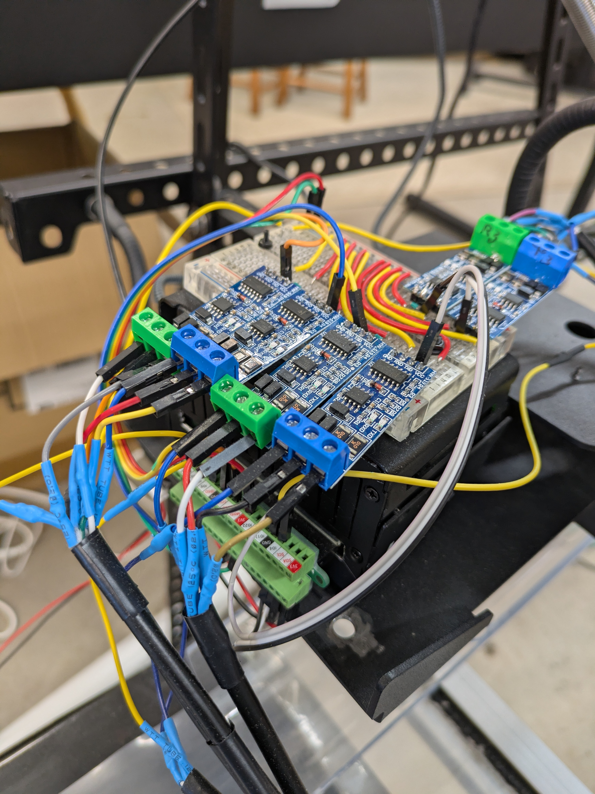
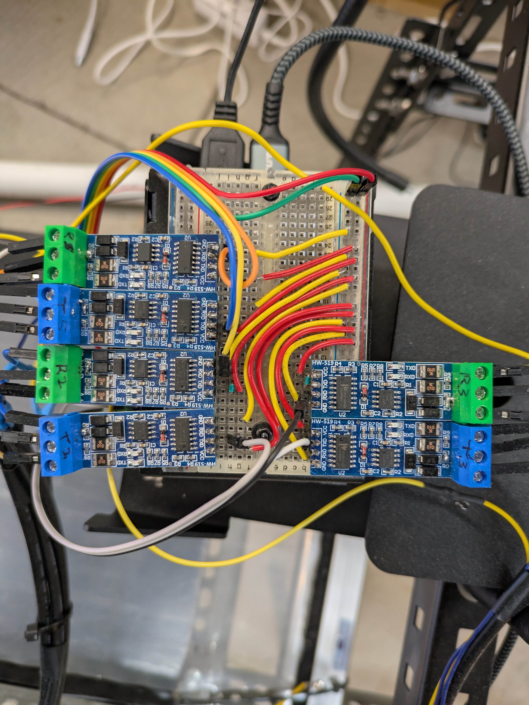
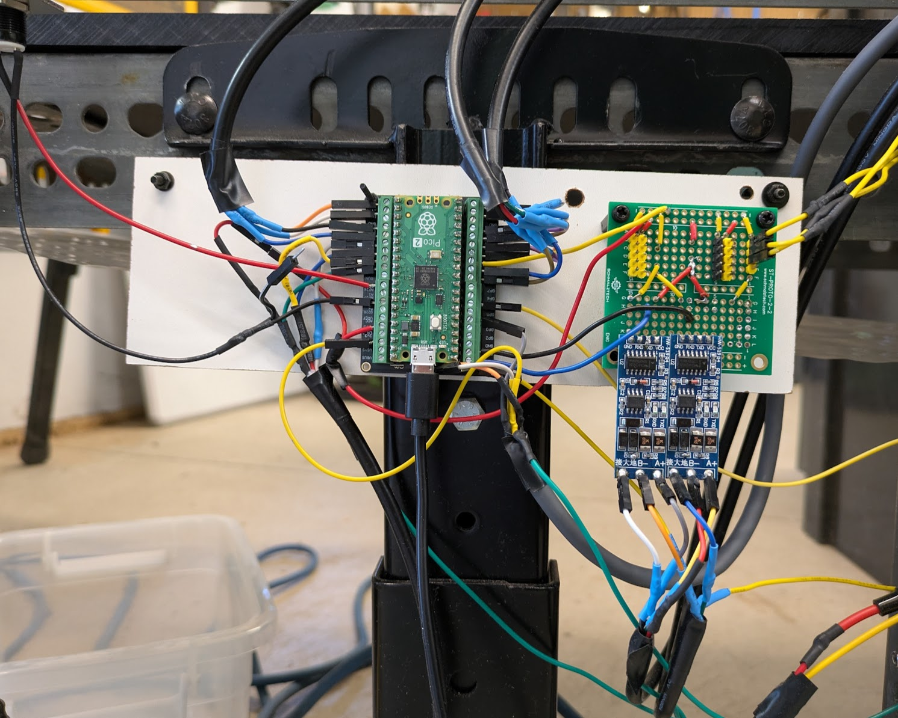
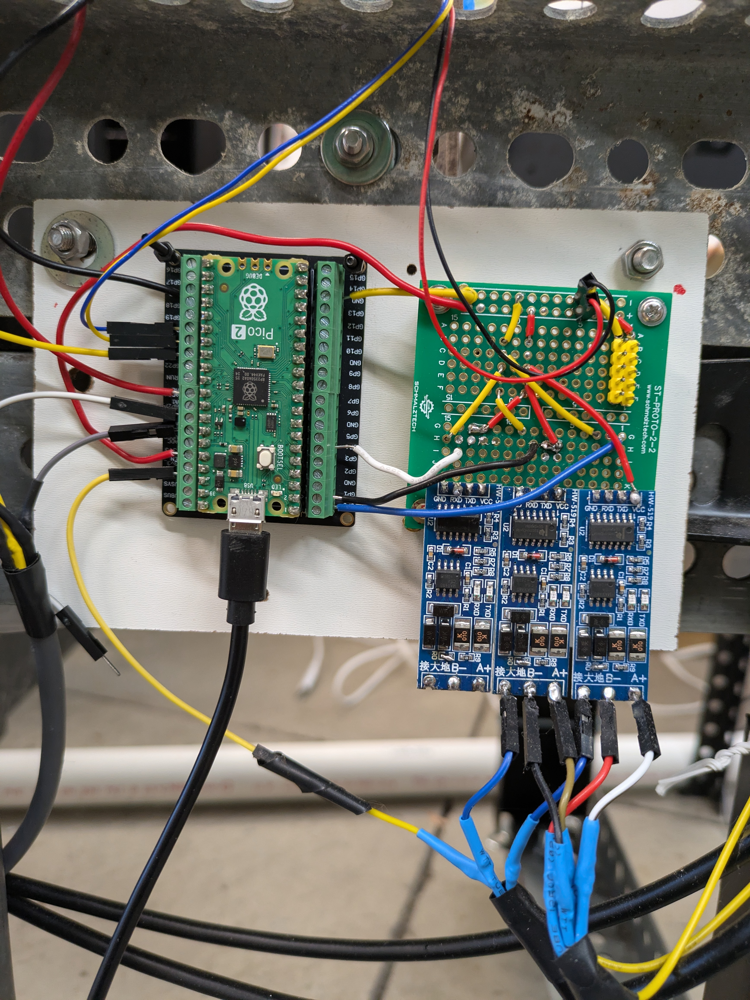
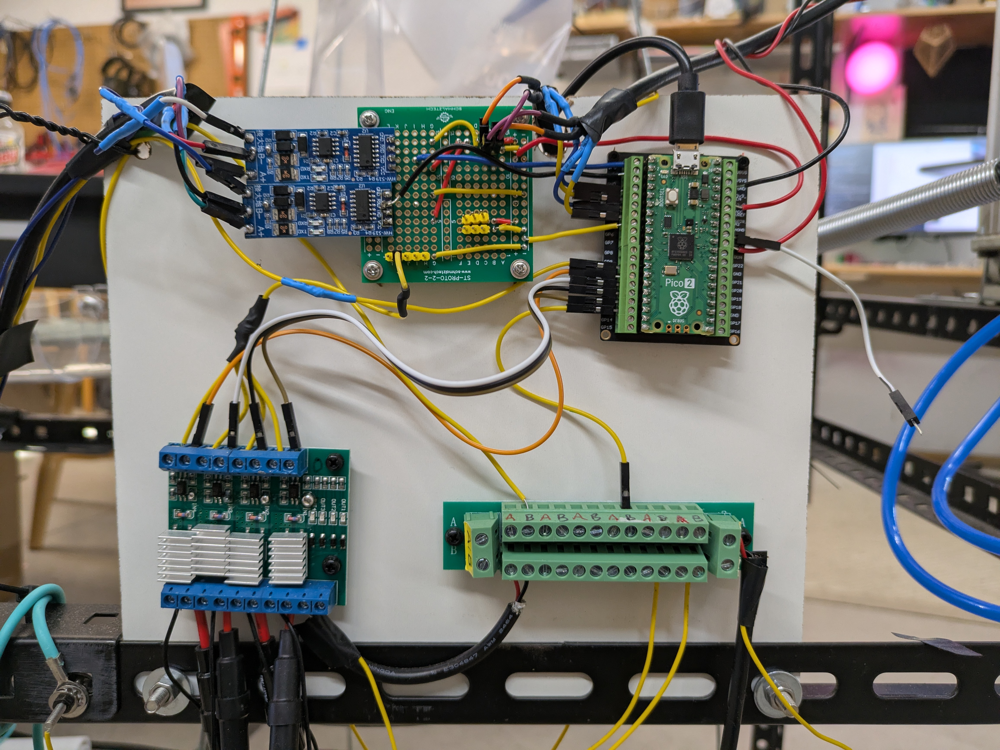

# Ninelives: Lightweight Distributed SCADA Middleware

There is a massive gap in physical automation. Hardware companies have manufactured an ocean of incredible, cheap 3.3V and 5V sensors. Yet, they are rarely used to their full potential. Why? Because the software ecosystems built for them assume a pristine electrical environment. The moment you introduce real-world physics—motor EMI, voltage drops, or unshielded wires—standard hobbyist libraries hang, drop packets, and crash the entire microcontroller.

The gap exists because there hasn't been a framework that marries modern, industrial software robustness with the flexibility of custom consumer hardware.

Ninelives is a robotics framework that assumes every signal might be compromised and addresses that head on. It is an industrial-grade, fault-tolerant SCADA (Supervisory Control and Data Acquisition) middleware built for individual machine builders and hobbyist hardware engineers.

If we wire these cheap components up seriously—operating under the assumption that lines will be noisy, connections will shake, and packets will fail—we can elevate simple sensors and cheap microcontrollers (Raspberry Pi Picos, Arduinos) into the cornerstones of complex, dependable robotics.

Ninelives allows you to take a spool of unshielded wire, a handful of hobbyist sensors, a few microcontrollers, and engineer a highly deterministic, resilient automation network that would normally demand an enterprise IT budget. Just load up the software on the limbs and RP5; you will need to use an LLM to write a simple read() driver, all error handling is passed and dealt with upstream.  

Traditional open-source SCADA projects (like FUXA or Scada-LTS) assume you are an Integrator who just dropped $10,000 on shielded, proprietary Siemens or Allen-Bradley PLCs. They rely on heavy Ethernet protocols and expect a pristine electrical environment.

Standard serial protocols break the moment a heavy motor spikes the voltage line. To survive this, Ninelives abandons generic libraries in favor of its own custom transport layer: the Message Transfer Interface Protocol (MTIP). By baking payload deduplication, strict checksums, and prioritized safety channels directly into the protocol, Ninelives trades raw bandwidth for absolute, deterministic reliability.

# Driver Paradigm 

In traditional C++ hobbyist environments, writing a robust driver requires hundreds of lines of complex error-handling to prevent the system from locking up during a hardware glitch. Ninelives eliminates this burden using the Humble Component Pattern.

If you want to add a completely new, unsupported sensor to your network, you only need to write a dead-simple MicroPython class with a read() method that pulls the raw data from the registers.

You do not write error handling. If a wire comes loose or a motor spike scrambles the I2C bus, your simple driver just lets the resulting OSError crash upward. The Ninelives SensorManager catches it.

* It automatically flags the sensor as offline.

* It increments the internal I2C Watchdog.

* If it detects 10 consecutive failures, the framework autonomously tears down the physical I2C pins, flushes the silicon buffer, and restarts the hardware bus from scratch in under 50 milliseconds.

You provide a simple driver; the framework provides the industrial armor.


---

## 🎥 System Demonstrations
See the Ninelives architecture and the Meow Turtle reference implementation in action:

<table align="center">
  <tr>
    <td align="center">
      <b>System Overview</b><br><br>
      <a href="https://www.youtube.com/shorts/_lPySIKtxEk" target="_blank">
        
      </a>
    </td>
    <td align="center">
      <b>Custom SCADA Dashboard UI</b><br><br>
      <a href="https://www.youtube.com/shorts/_swgFbqY9CQ" target="_blank">
        
      </a>
    </td>
  </tr>
  <tr>
    <td align="center">
      <br><b>Bare-Metal RS-485 OTA Flashing</b><br><br>
      <a href="https://www.youtube.com/shorts/J-ZnQ0d7hsk" target="_blank">
        
      </a>
    </td>
    <td align="center">
      <br><b>Automated Conveyor Build</b><br><br>
      <a href="https://www.youtube.com/shorts/nO7yFYWuznI" target="_blank">
        
      </a>
    </td>
  </tr>
</table>

---

## ⚖️ System Limits & Scalability
Ninelives trades high bandwidth for extreme, deterministic reliability over bare-metal serial connections.
* **The Bandwidth Limit:** The system runs over RS-485 at 115,200 baud, giving a maximum theoretical throughput of ~11.5 Kilobytes per second. This is strictly for telemetry, state synchronization, and hardware commands. Heavy compute (like AI vision) must remain on the host RP5.
* **The Node Topology:** A single RP5 "Brain" can comfortably manage an RS-485 bus of 4 to 8 Pico "Limbs".
* **The Component Density:** Each Pico can reliably manage roughly 10 physical hardware abstractions (e.g., 2 I2C sensors, 4 pneumatic solenoids, 2 PWM vibratory motors, 2 digital limit switches) at microsecond precision.
* **Horizontal Scaling:** Need 100 actuators? You don't overload the bus. You simply add a second RP5 Brain to the network, commanding its own dedicated RS-485 fleet of Picos.

## 🧠 The Ninelives Core Architecture
The framework abandons traditional reactive control loops. Instead, it operates on a "Split-Brain" philosophy:

* **The Passive Digital Twin (Host):** The RP5 Logic Engine never queries the hardware directly. It operates entirely against a real-time, memory-resident object model (the Digital Twin) that passively ingests telemetry and mirrors the physical reality of the factory floor.
* **The MTIP Protocol (Transport):** Communication utilizes the custom Message Transfer Interface Protocol (MTIP). It features payload deduplication, CRC-16 checksums, and prioritized queueing. Critical safety alarms (0x48) bypass standard command queues to guarantee sub-second system-wide Emergency Stops. *New:* Features the "W-Protocol" for piggybacking memory wipes, ensuring physical events are perfectly acknowledged even in heavy motor EMI.
* **"Humble" Firmware (The Limbs):** The Pico firmware (`app.py`) is completely generalized. It has zero business logic. It reads a `config.json` file, turns pins HIGH/LOW, applies EMA (Exponential Moving Average) filters to sensor noise, and manages physical soft-starts to prevent electrical brownouts.
* **Industrial Hardening:** The framework features Phase-Locked Garbage Collection to prevent motor stutters, atomic OTA (Over-The-Air) flash updates with automatic rollback on boot failure, and a "Closed-Loop Verification" system that uses fuzzy logic (Confidence Decay) to demand physical sensor proof for every actuator state change. *New:* Incorporates Bayesian Link Quality Indicator (LQI) filtering, a Unified Thermal Hierarchy (Throttle/Pause/E-Stop), and physical RS-485 transmission locks.
* **The Flight Recorder:** Features a central asynchronous telemetry router with strict namespace isolation to parse hardware diagnostics to disk without flooding the NiceGUI DOM, utilizing Bayesian signature deduplication for maximum browser UI stability.

---

## 📸 Hardware Architecture (Bare-Metal Implementation)
Ninelives is not just theoretical middleware. It is built to run physical machinery. Below is the active hardware routing that powers the Meow Turtle reference implementation:

**The Central Nervous System:** The Raspberry Pi 5 Host with its custom RS-485 hat - 3 full-duplex transceivers, routing MTIP packets to the distributed fleet.

<div align="center">
  
  
</div>
<br>

**The RP2350 Limbs:** Each Pico node is responsible for a dedicated physical domain (Vibratory Loaders, Breakbeam Sensing, and Pneumatic Solenoid control), converting the digital commands from the RS-485 bus into physical kinetic action.

<div align="center">
  
  
  
</div>

---

## 🐢 Reference Implementation: "Meow Turtle" Lego Sorter
To stress-test the Ninelives framework, this repository includes the codebase for **Meow Turtle**: a high-speed, high-precision robotic sorting machine for singulating and cataloging small Lego parts.

Instead of writing a monolith, the sorting logic is built entirely on top of the generic Ninelives API.

### The Brain (RP5 Software Controller)
* **`core0 - Commander`/ :** The "Self-Aware" System Coordinator. Runs the asyncio Python logic loop, maintains the Digital Twin, and serves the NiceGUI browser-based control panel.
* **`core1 - Surveyor`/ :** The Vision Process node. Analyzes images, identifies parts, and pushes high-bandwidth AI results to the internal Synapse Bus (completely isolated from the RS-485 hardware bus).
* **`core3 - Librarian`/ :** The Database Process node. Manages inventory databases, kit lists, and order fulfillment tracking.

### The Limbs (RP2350 Firmware)
Because Ninelives relies on a generalized hardware layer, these nodes run identical `app.py` firmware. Their roles are defined entirely by their local `config.json`:
* **`pico1`/ (The Loader):** Manages bulk material handling. Controls tipper motors and vibrating shakers to normalize the input flow of pieces.
* **`pico2`/ (The Gatekeeper):** Handles high-precision sensing. Uses PIO state machines and TSL2591 light sensors as high-speed beam breaks to assign "Spatial Birth Certificates" (exact global pulse counts) to incoming parts. Armed with an Asymmetric Gated EMA and Temporal Debounce to reject sub-millisecond vibrational noise and belt seams.
* **`pico3`/ (The Distributor):** Executes precision sorting. Controls the main BLDC conveyor motor and fires specific functional air solenoids (Bins 1-10).
* **`pico_template`/ :** The base firmware environment for any new limb on the network, easily deployed to the fleet via the Mass OTA Flasher utility. 

### ⏱️ Time-as-Distance Routing
To achieve industrial sorting precision, Meow Turtle does not use standard wall-clock time, which is vulnerable to belt friction and mechanical load variations. Instead, it utilizes Ninelives' PIO pulse-counting abstractions. By tracking physical motor tachometer pulses, sorting decisions are made strictly based on physical distance traveled (`mm_per_pulse`), rendering the entire system completely speed-invariant. This is actively maintained via an interactive NiceGUI Spatial Calibration Wizard that live-calculates physical belt ratios.

## 🚀 Quick Start & Installation

Ninelives relies on a specific distributed architecture. You will need a Host (Raspberry Pi 5 recommended) and at least one Limb (Raspberry Pi Pico / RP2350).

### Step 1: The Brain (Host Setup)
The Host acts as the central coordinator and serves the SCADA dashboard.
1. Flash a Raspberry Pi 5 with standard Raspberry Pi OS (Debian).
2. Wire up your full-duplex RS-485 transceivers (or a custom RS-485 HAT) to the Pi's hardware UART pins. Take note of your `/dev/ttyAMA*` interfaces.
3. Clone this repository and navigate to the Host directory:
   ```bash
   git clone https://github.com/squid-protocol/meow-turtle.git
   cd "core0 - Commander"
   ```
4. Install the required Python dependencies:
   ```bash
   pip install -r requirements.txt
   ```
5. Update `config/settings.py` to map your physical UARTs to the logical Pico Port IDs (e.g., `PORT_MAP = {1: '/dev/ttyAMA0', 2: '/dev/ttyAMA2'}`).

### Step 2: The Limbs (Pico Firmware)
The Limbs run entirely on generalized MicroPython. They require zero custom compilation.
1. Flash your Raspberry Pi Picos with the latest stable [MicroPython](https://micropython.org/) `.uf2` image.
2. Using a tool like `mpremote` or Thonny, copy the contents of the `pico_template/` directory directly to the root of the Pico.
   * `app.py` (The generalized Ninelives main loop)
   * `boot.py` (Handles watchdog setup on power delivery)
   * `lib/` (Contains the Ninelives base libraries: `sensors.py`, `actuators.py`, `meowprotocol.py`)

### Step 3: Configuration & Custom Drivers
Your Pico is now a blank slate. You define its industrial role strictly through JSON and simple drivers.
1. Create a `config.json` on the root of the Pico. Define its `device_id` (1-8), its `role`, and map out your physical pins for I2C, PIO counters, and digital relays.
2. **Add Custom Hardware:** If you have a specific sensor (like an MPU6050 Gyro or a TSL2591 Breakbeam), write a simple MicroPython class with a `read()` method. Drop that `.py` file into the Pico's `/lib` folder.
3. Update the `config.json` to reference your new driver. The Ninelives `SensorManager` will automatically discover it on boot, manage the I2C lifecycle, and protect the bus from lockups.

### Step 4: Ignition
With the Picos powered via 5V rails and connected to the RS-485 bus, start the Host architecture:
```bash
python3 app.py
```
Open a browser to `http://localhost:8080`. The Digital Twin will automatically perform a fleet discovery handshake, verify the Pico versions, and present the full SCADA dashboard. Click **START** to engage the arming interlocks and begin physical execution.

### 👻 Step 5: Emergency Recovery (The Ghost Exit)
Because Ninelives utilizes a strict hardware watchdog to auto-recover from transient crashes, a fatal bug pushed to `app.py` via OTA could theoretically lock the Pico in a continuous bootloop, preventing standard network updates. 

To guarantee the network remains un-brickable, the framework features a fallback state called **Ghost Mode**. If a node crashes repeatedly or is manually triggered, it aborts standard actuator logic and drops into a safe, serial-listening state. To rescue the node, the Host uses a dedicated bridge utility to inject raw MTIP protocol packets directly over the RS-485 bus.

To rescue a locked node, run the diagnostic bridge from the Host:
```bash
cd "core0 - Commander/utilities"
python3 ghost_exit.py
```
Select the physical connection (e.g., `[2]` for Pico 2 on `ttyAMA2`), and press `[e]` to broadcast the raw `EXIT` command. This terminates Ghost Mode and returns the microcontroller to a flashable state.

### 📡 Step 6: Fleet Management (Mass OTA Flashing)
Once your physical machine is bolted together, you do not want to walk around with a laptop plugging USB cables into individual microcontrollers to update code. 

Ninelives includes an Enterprise-grade Mass OTA (Over-The-Air) Flasher. This utility leverages the MTIP protocol to blast chunked binary updates from the Host RP5 directly over the RS-485 bus to the distributed Pico fleet. It features autonomous recovery loops, CRC-16 CCITT packet verification, and final SHA-256 hash checks to guarantee zero corruption, even if a motor fires during the flash. More resilient than Thonny data transfers. 

To update `app.py` across the entire fleet (`-t A` for All) simultaneously:
```bash
cd "core0 - Commander/utilities"
python3 mass_ota_flasher.py -t A -f ../../pico_template/app.py
```
You can also target specific nodes (e.g., `-t 1,3`) or push multiple files in a single batch deployment.